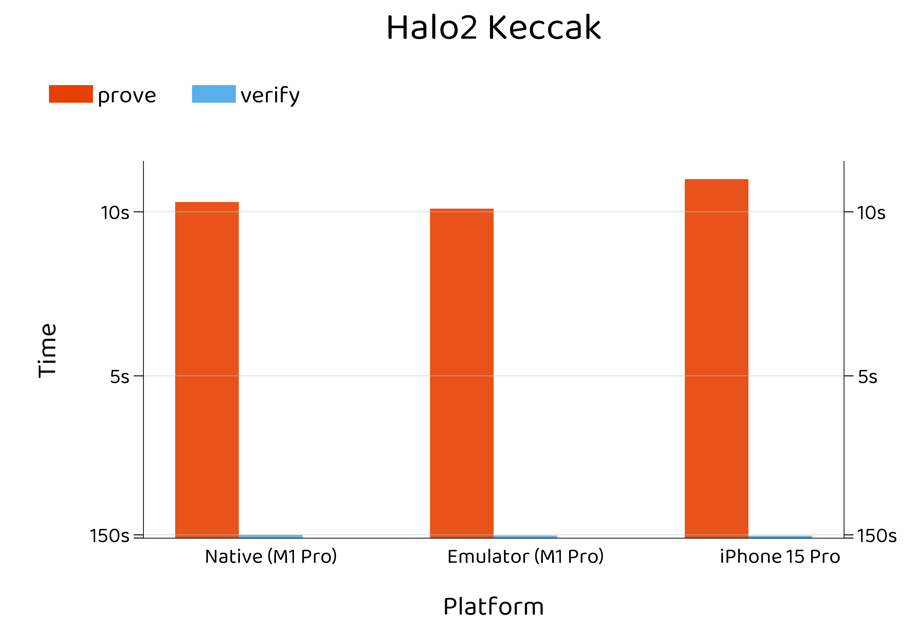
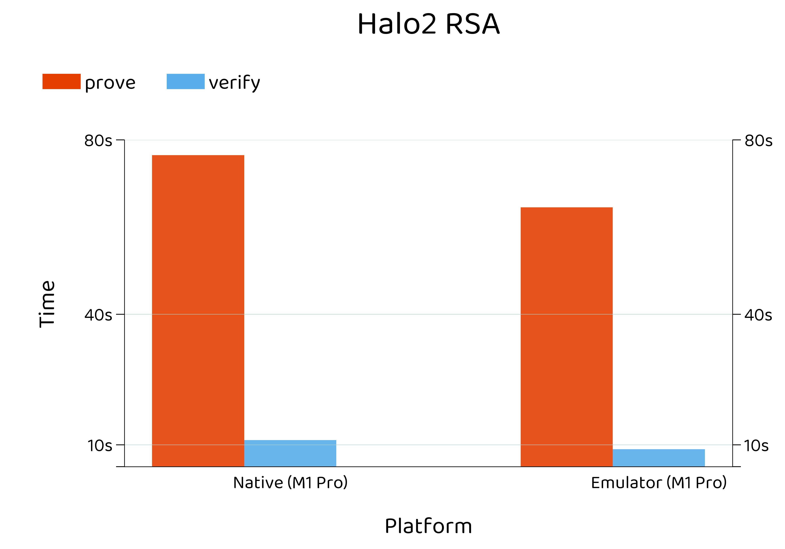

### Benchmarks

Plots for [mopro](https://zkmopro.org/docs/performance) client-side proving

```
uv init
uv add matplotlib toml
uv run src/main.py data/[toml file]
```

<table>
  <tr>
    <td><br>Circom Android Proof Generation</td>
    <td><br>Circom Android Witness Generation</td>
  </tr>
  <tr>
    <td><br>Circom iOS Proof Generation</td>
    <td><br>Circom iOS Witness Generation</td>
  </tr>
  <tr>
    <td><br>Circom MacOS Proof Generation</td>
    <td><br>Circom MacOS Witness Generation</td>
  </tr>
  <tr>
    <td><br>Halo2 Keccak Proof Generation</td>
    <td><br>Halo2 RSA Proof Generation</td>
  </tr>
</table>

