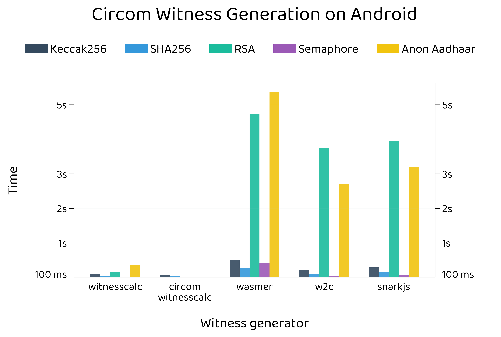
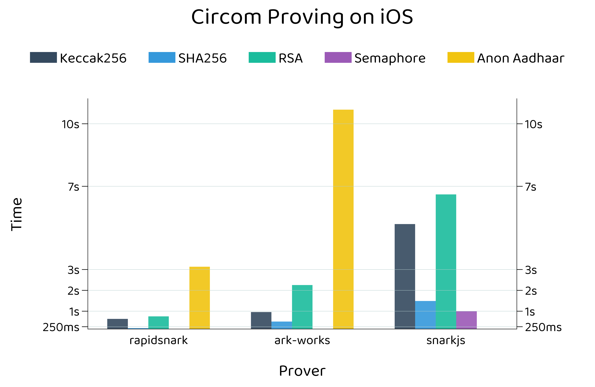
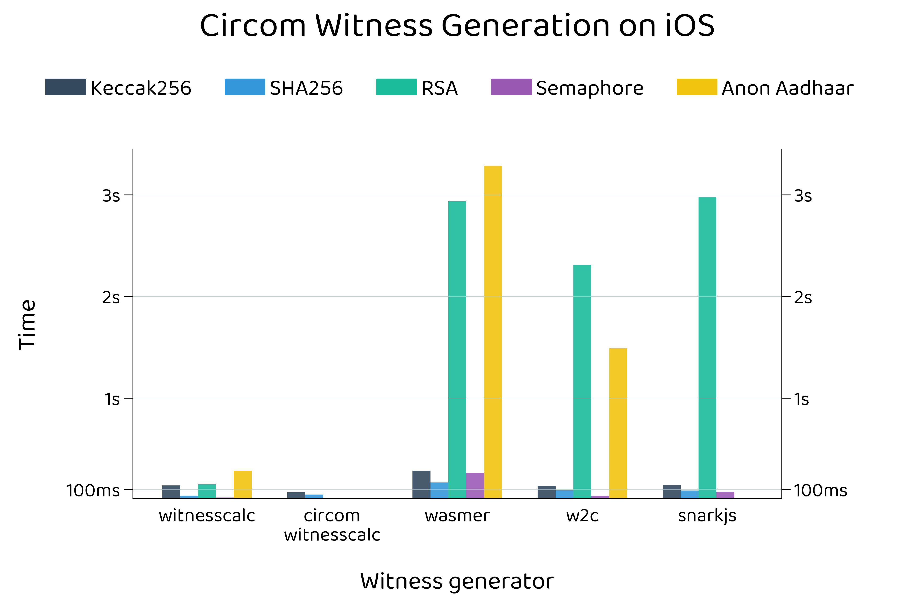

### Benchmarks

Plots for [mopro](https://zkmopro.org/docs/performance) client-side proving

```
uv init
uv add matplotlib toml
uv run src/main.py data/[toml file]
```

### Notes
- Depending on the data source, you can set `transpose` to true for convenience (in `/data/[toml file]`), which transposes `dataset`
- Changint `y_ticks` in `/data/[toml file]` does affect how "stretched" the bars are. You may want to include a lower tick to better dilineate low-value perf benchs, while leaving their corresponding `y_tickslabels` empty "" to reduce crowding
  - Take a look at different [scales](/scale) 
- To change the grouping of the bars, one can swap `rows` and `columns` and flip the `transpose` value in the toml file (to see this, diff a `data/*_by.bench.toml` and the corresponding `data/*_by.poroject.toml` files)

<br>

<table>
  <tr>
    <td><br>Circom Android Proof Generation</td>
    <td><br>Circom Android Witness Generation</td>
  </tr>
  <tr>
    <td><br>Circom iOS Proof Generation</td>
    <td><br>Circom iOS Witness Generation</td>
  </tr>
  <tr>
    <td><br>Circom MacOS Proof Generation</td>
    <td><br>Circom MacOS Witness Generation</td>
  </tr>
  <tr>
    <td><br>Halo2 Keccak Proof Generation</td>
    <td><br>Halo2 RSA Proof Generation</td>
  </tr>
</table>

