## Log3 scale

<table>
<tr>
<td align="center">
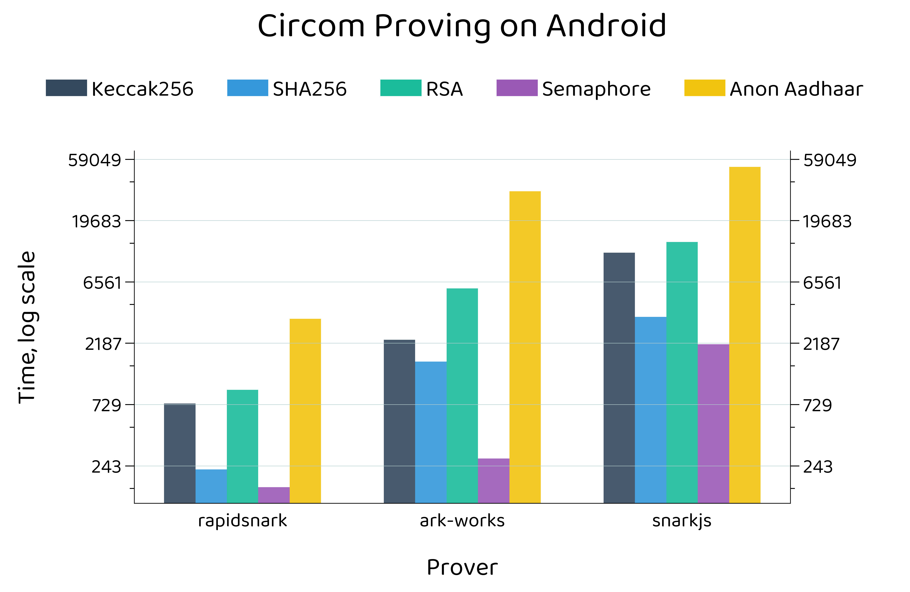
 
circom android proof gen by bench
</td>
<td align="center">
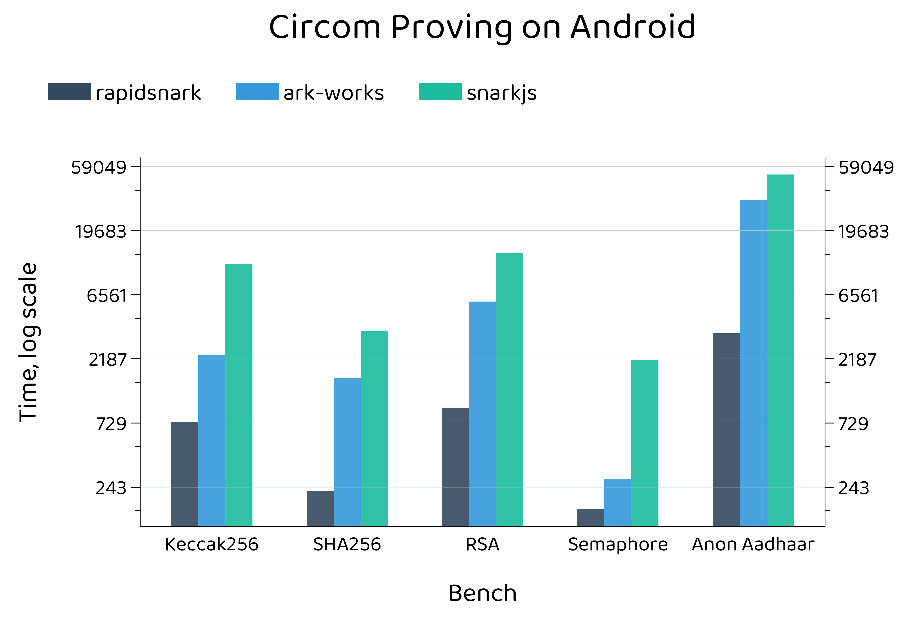
 
circom android proof gen by project
</td>
</tr>
<tr>
<td align="center">
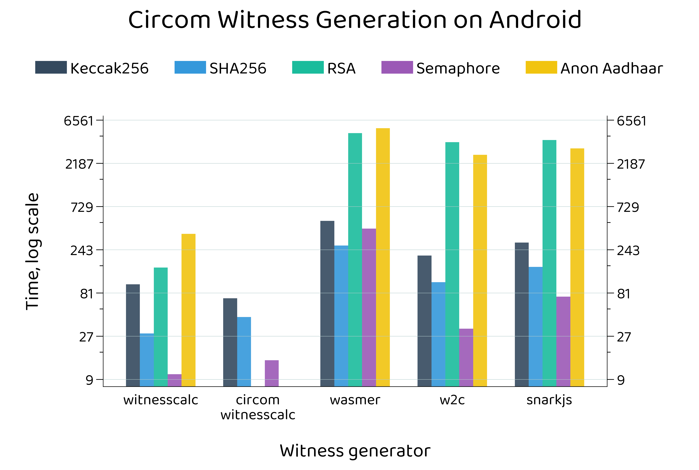
 
circom android wit gen by bench
</td>
<td align="center">
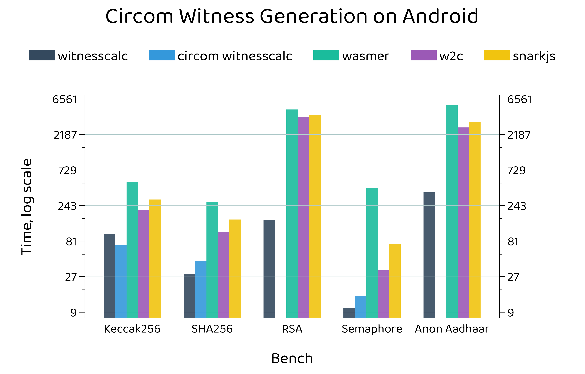
 
circom android wit gen by project
</td>
</tr>
<tr>
<td align="center">
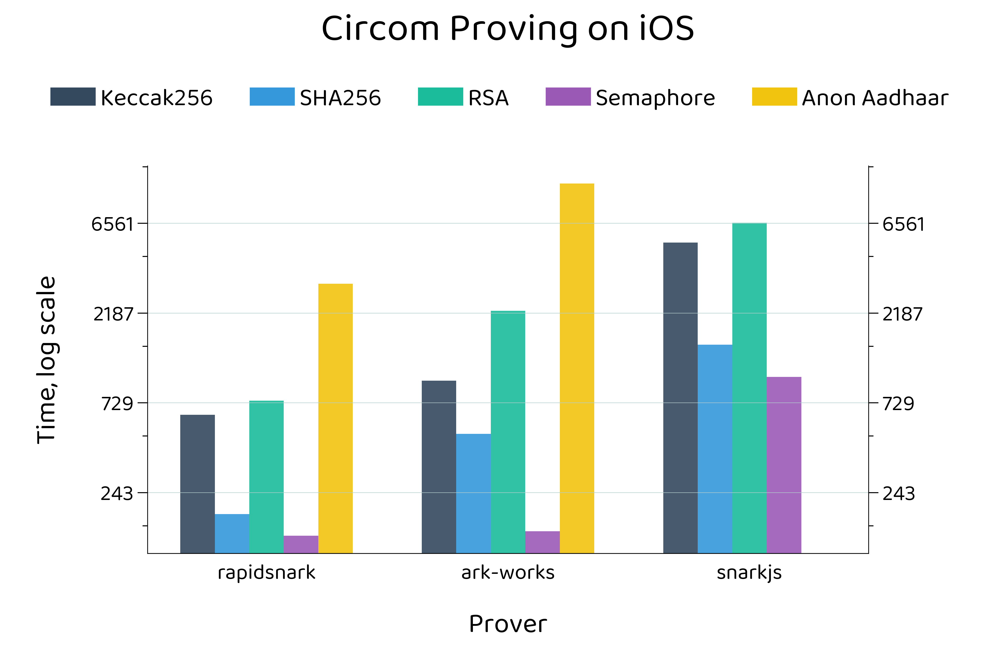
 
circom ios proof gen by bench
</td>
<td align="center">
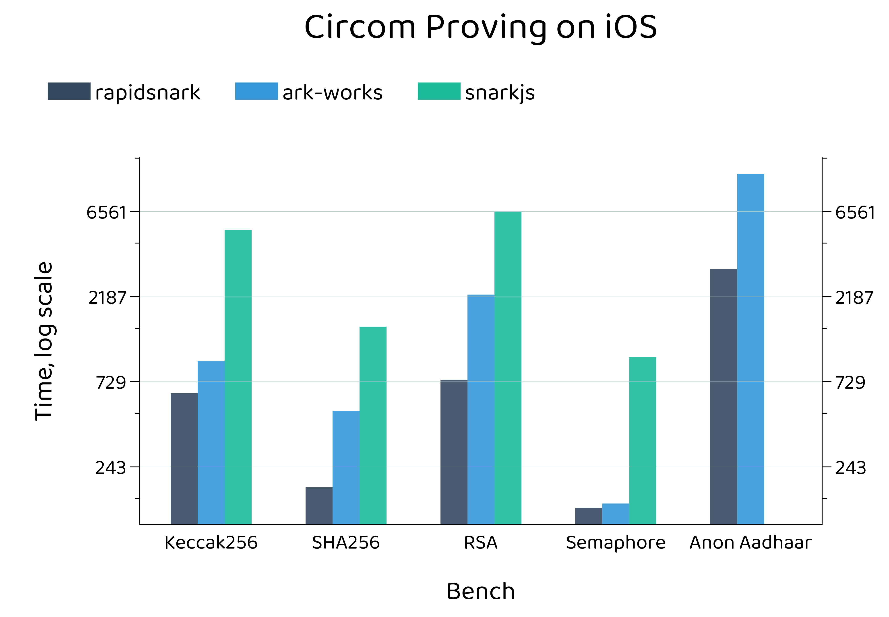
 
circom ios proof gen by project
</td>
</tr>
<tr>
<td align="center">
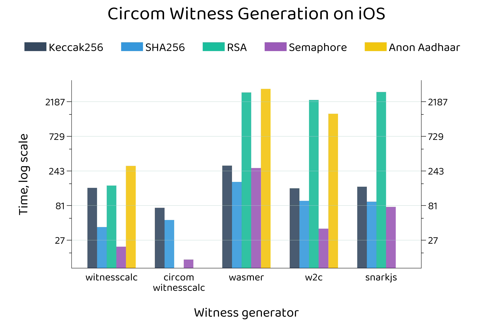
 
circom ios wit gen by bench
</td>
<td align="center">
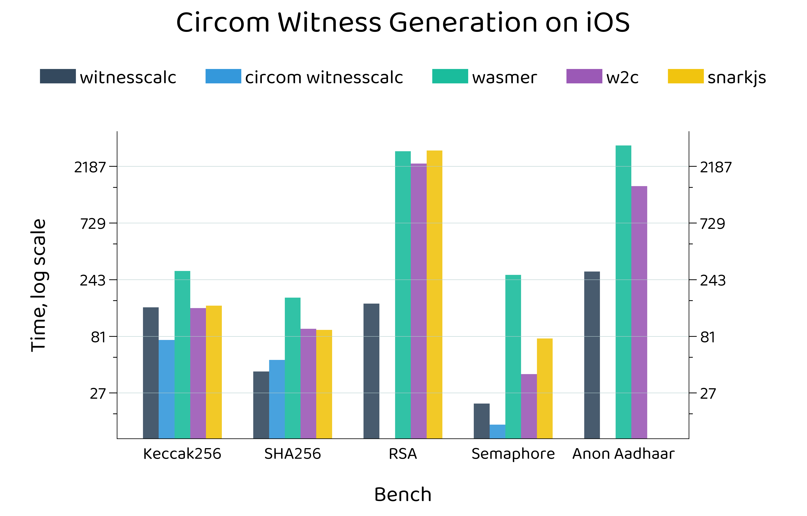
 
circom ios wit gen by project
</td>
</tr>
<tr>
<td align="center">
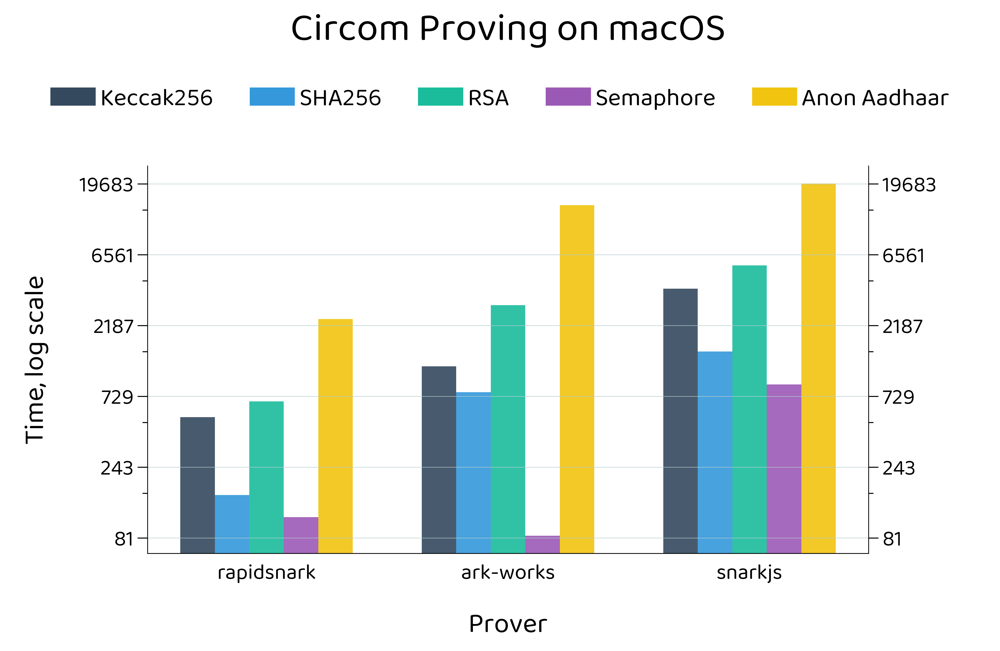
 
circom macos proof gen by bench
</td>
<td align="center">
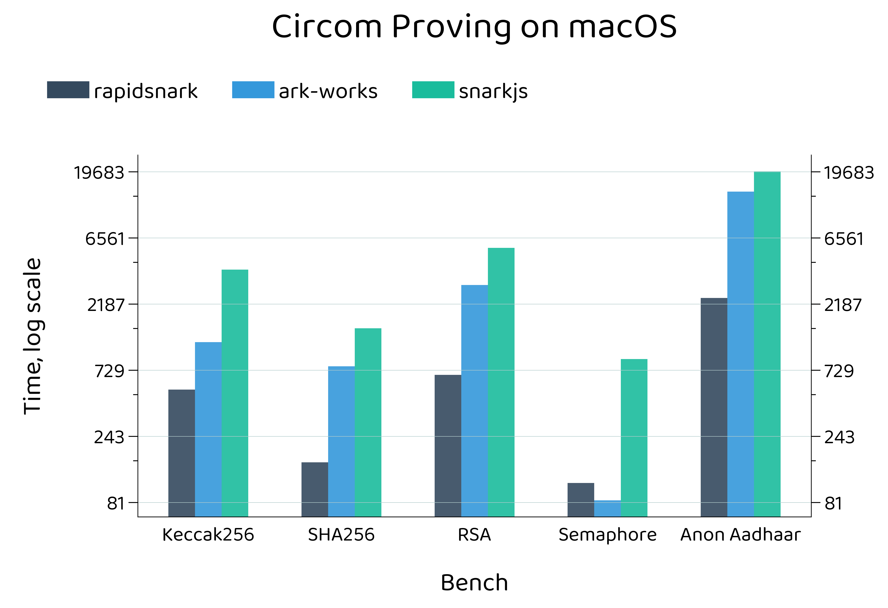
 
circom macos proof gen by project
</td>
</tr>
<tr>
<td align="center">
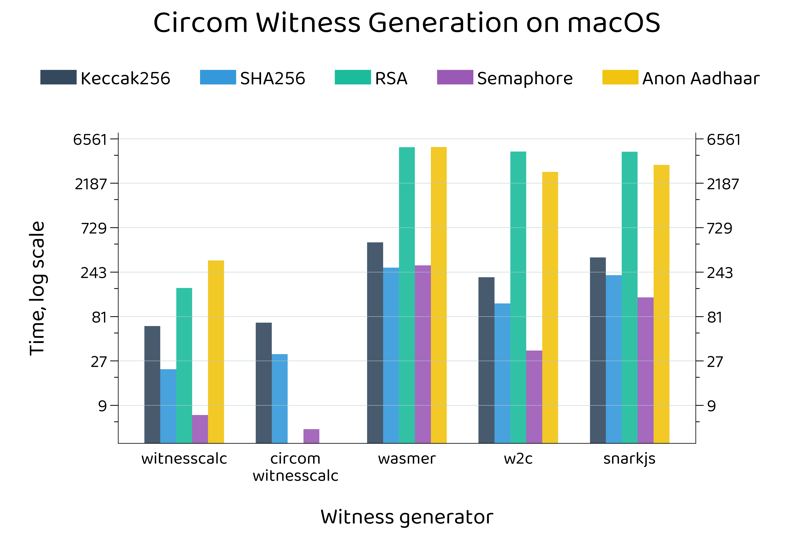
 
circom macos wit gen by bench
</td>
<td align="center">
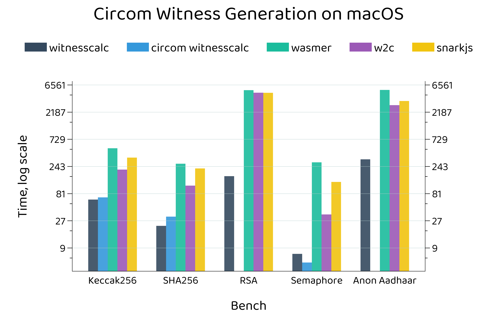
 
circom macos wit gen by project
</td>
</tr>
<tr>
<td align="center">
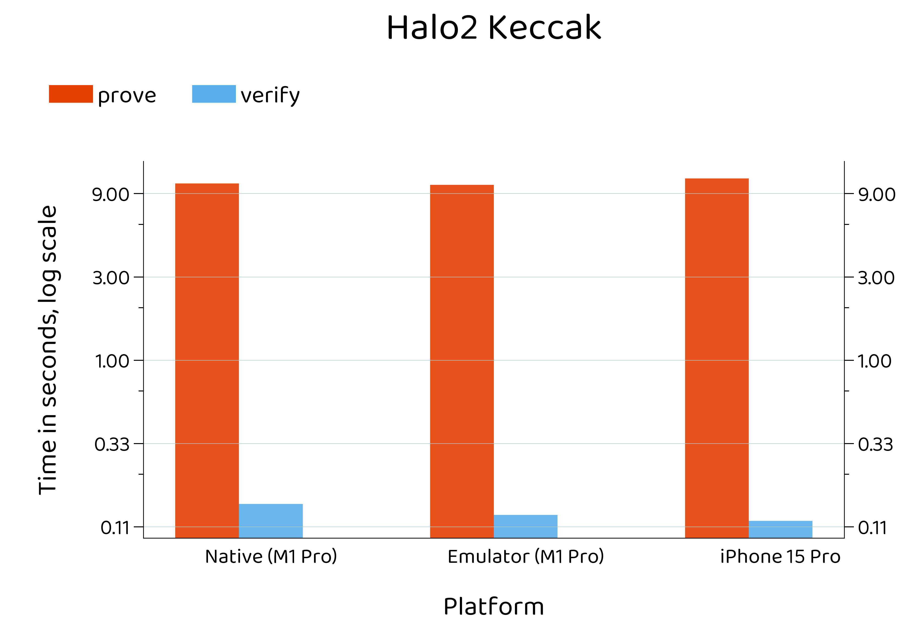
 
halo2 keccak proof gen
</td>
<td align="center">
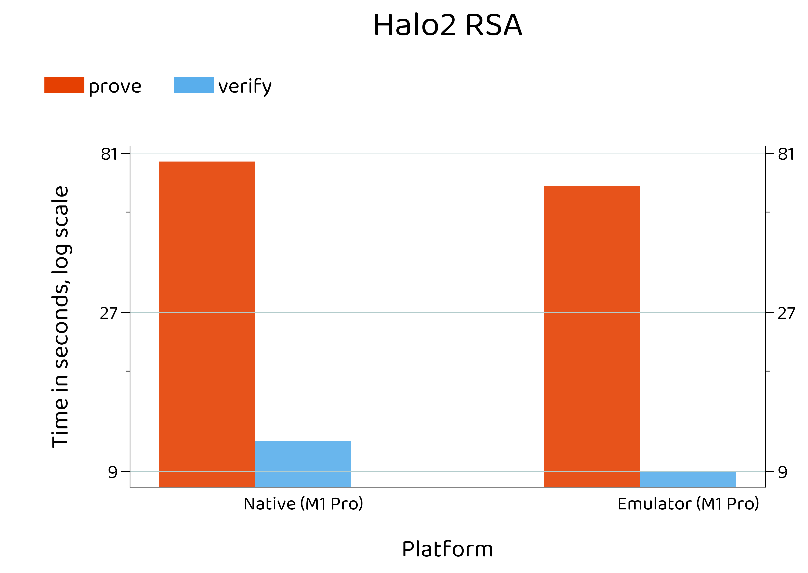
 
halo2 rsa proof gen
</td>
</tr>
</table>
